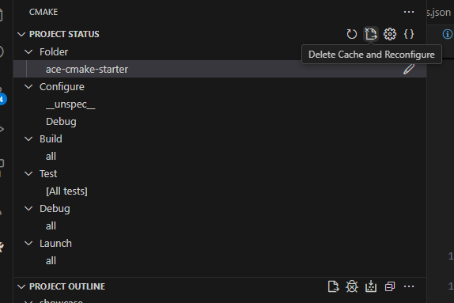
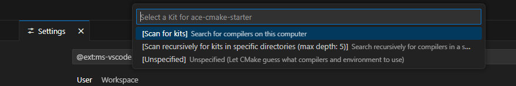

# ACE cmake starter project

This project is created to make newcomers easy start with ACE development. Project should be ready to build and run on Windows and Linux. 

## Why should i use this project?

Ace is not only a library it's a framework for Amiga Game development. ACE with cross compiliation environment brings modern development experience. You may be not familiar with topics like crosscompliation, cmake setup or even git workflows so this repo tries to cover all those topics. You can purely focus on C coding.

## How to use it on Windows
1. Download toolchain from https://github.com/brechtsanders/winlibs_mingw/releases/download/14.2.0posix-12.0.0-ucrt-r3/winlibs-x86_64-posix-seh-gcc-14.2.0-llvm-19.1.7-mingw-w64ucrt-12.0.0-r3.7z
1. Extract it to C:\mingw64
1. Add C:\mingw64\bin to PATH
1. Install Visual Studio Code from: https://code.visualstudio.com/
1. Install git for windows: https://git-scm.com/downloads/win
1. [Clone repository with submodules](#How-to-clone-repository-with-submodules)
1. Run bat script from AmigaCMakeCrossToolchains sub folder (as admin) - setup-amiga-elf.bat
1. Run build_ace_tools.bat 
1. Open VSCode
1. Install extensions:
    - CMake tools - https://marketplace.visualstudio.com/items?itemName=ms-vscode.cmake-tools
    - Amiga C/C++ Compile, Debug & Profile - https://marketplace.visualstudio.com/items?itemName=BartmanAbyss.amiga-debug
1. Put Amiga 1.3 kickstart file in folder C:\Amiga\kick13.rom
1. Open folder with project
1. Open Cmake extension, select main folder and run reconfigure

1. Select unspecified kit if asked

1. Go to run and debug and start "Run-Debug-Win32"

## How to use it on Linux
1. Install cmake, make, git from using package manager
1. Install vscode
1. [Clone repository with submodules](#How-to-clone-repository-with-submodules)
1. Run sh script from AmigaCMakeCrossToolchains sub folder
1. Open VSCode
1. Install extensions:
    - CMake tools - https://marketplace.visualstudio.com/items?itemName=ms-vscode.cmake-tools
    - Amiga C/C++ Compile, Debug & Profile - https://marketplace.visualstudio.com/items?itemName=BartmanAbyss.amiga-debug
1. Put Amiga 1.3 kickstart file in folder ~\amiga\kick13.rom
1. Open folder with project
1. Open Cmake extension, select main folder and run reconfigure 

1. Select unspecified kit if asked

1. Go to run and debug and start "Run-Debug-Linux"

## How to clone repository with submodules
```
git clone --recursive https://github.com/mirq/ace-cmake-starter.git my-amiga-project
```